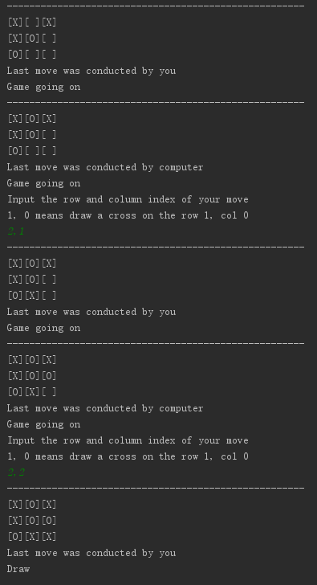

# isee_2021_Spring_AI_proj1
A* algorithm for n_puzzles and Minimax Search for tictactoe

# n-Puzzle Promblem 项目说明

## 简介
本项目要求实现一个A-star搜索算法来求解15-Puzzle问题。
## 依赖
* Python3
* Numpy
* copy

## 文件结构
**puzzle_state.py** 
* 定义了表示问题状态的类PuzzleState，初始化参数square_size表示其对应的棋盘边长，当square_size = 3时，表示3 x 3的棋盘格，即8-puzzle问题，在本项目中我们将square_size设为4
  * **这部分代码不需要修改**
  * 你可以通过调用 generate_state()成员函数来随机生成棋盘格的状态,**需要设定random参数**
  
* 定义了用于测试的相关函数
  * run_moves()函数可以用于判断生成的移动指令是否可以从初始状态到达目标状态
  * print_moves()函数会打印中间移动指令的执行过程
  
* 预留了astar_search_for_puzzle_problem()函数接口，**需要自行实现**

**n_puzzle_state_main.py** 
* n-Puzzle问题主函数，当前版本预设为15-puzzle版本（即square_size = 4）
* 设定了固定的目标状态，起始状态是通过在目标状态上随机执行一定步数的移动指令生成，当前设置为100步
* **本文件不需要修改**，在实现astar_search_for_puzzle_problem()函数后，会执行移动指令并打印结果

## 任务要求
实现puzzle_state.py中的**astar_search_for_puzzle_problem()函数**。

函数输入参数为init_state（起始状态）与dst_state（目标状态），返回值为move_list（移动指令列表）。

当我们依次执行move_list中的移动指令，可以从init_state到达dst_state

我们提供了该函数的一个大致程序结构，以下是其简要的说明。**注意，这部分代码仅供参考，并非最佳的实现方式**

* astar_search_for_puzzle_problem()函数中有预留部分的子函数接口
  * find_front_node(open_list)：当前的open_list并未采用priority_deque，因此需要手动搜索最优先节点数
  * state_in_list(state, list): 判断该状态是否存在与该list中
  * get_path(curr_state): 从当前状态开始回溯到起始状态，返回对应的移动指令列表
  * expand_state(curr_state): 扩展当前状态，生成子节点。**这里你可能需要用到once_move()函数**
    * once_move()函数会更新子节点中的父节点信息，**但不更新其代价**
  * update_cost(curr_state, dst_state): 更新当前状态的代价（包括g和h值）。**在此处你需要实现你的启发式函数计算**
* 该实现中，对open_list的处理方式是较为简单的处理方式，你可以通过自定义list的插入函数来实现priority_deque，以提升算法的效率

**我们鼓励你自行设计该函数，但是请明确使用 update_cost() 这一子函数，以便于我们了解你的启发式函数具体设计**
  
### 其他建议
* 本项目中，移动方向对应棋盘格中的空格移动方向，请注意区分
* 注意检查返回的移动指令顺序，以及对应的变量类型
* 初期测试中，你可以适当调低main函数中generate_moves()函数的输入步数，以获得相对简单的测试场景
* 启发式函数的性能会极大地影响搜索效率，想要获得更难的测试场景，我们当前有提供部分函数接口：
  * 增大主函数中generate_moves()的输入参数，可以获得更大搜索深度的测试场景
  * 主函数中初始状态和目标状态都使用generate_state()成员函数随机生成（**当然你也可以手动设计较难的状态**）
  * 增大square_size，在24-puzzle甚至35-puzzle等更困难的问题上进行测试

# Tic-tac-toe 项目说明
## 任务
本编程作业要求实现基于MiniMax Search的tic_tac_toe问题解决方案。

## 程序框架
样例程序包含两个文件：main_tic_tac_toe.py以及tic_tac_toe.py

**tic_tac_toe.py:**

* 实现了GameJudge类，用于判断当前状态的输赢情况，这部分代码不需要修改；

* 实现了MiniMax_Search函数的基本流程，但是关键步骤的子函数代码 (eg. min_value, max_value, utility函数) 要求自己编写；

**main_tic_tac_toe.py：**

* 测试文件，从tic_tac_toe.py中导入GameJudge和Minimax_Search，实现用户和电脑之间的博弈过程。

完成tic_tac_toe.py文件之后，可以运行main_tic_tac_toe.py测试自己写的Minimax Search算法得到的落子是否合理。一般情况下，如果Minimax Search算法实现合理，电脑和用户总是能下成平局。

## Minimax Search算法实现说明
本作业要求实现Minimax Search算法，并要求有限搜索深度 (depth=3)。实现过程中，为了保证程序细节的一致性，我们事先做出以下约定：
1. 电脑玩家 (用1表示) 使用circle，你 (用-1表示) 使用cross；
1. 电脑玩家是MAX user，你是MIN user，也就是说电脑的落子要使utility最大，而你落子要使utility最小；
1. Minimax Search的搜索深度限定为3 (depth=3足够得到合理的落子)，也就是你落子的时候会往前多算两步；
1. 你先落子；

Minimax Search算法的基本流程为，对于电脑玩家：
1. 找出当前状态下所有可以落子的地方；
1. 采用depth limited minimax search方法估计每一个落子的地方的utility；
1. 在utility最大的地方落子；

## 正确运行样例

